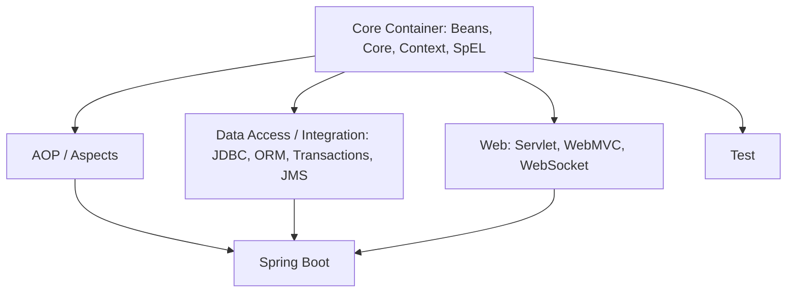

# Module 1: Introduction to Spring

## Topics Covered
- Challenges with traditional Java EE applications
- Spring Framework overview
- Spring ecosystem and modules
- Spring architecture

---

## 1. Challenges with Traditional Java EE Applications

Before Spring, enterprise Java (J2EE/Java EE) development suffered from several pain points:

- **Heavyweight components** — EJBs required verbose home/remote interfaces and a full application server to run and test.
- **Tight coupling** — Business logic was often tangled with infrastructure code (JNDI lookups, transaction/resource management), making unit testing difficult.
- **Boilerplate configuration** — XML deployment descriptors were large, repetitive, and error-prone.
- **Poor testability** — Components depended on container services, so testing outside an app server was hard.
- **Slow development cycles** — Deploying to an application server for every change slowed down iteration.

Spring was created to address these issues with a lightweight, POJO-based programming model.

## 2. Spring Framework Overview

Spring is an open-source, lightweight application framework for the Java platform. Its core value propositions:

- **Plain Old Java Objects (POJOs)** as first-class citizens — no need to implement framework-specific interfaces.
- **Inversion of Control (IoC)** container manages object creation and wiring.
- **Aspect-Oriented Programming (AOP)** support for cross-cutting concerns (logging, transactions, security).
- **Non-invasive** — Spring rarely forces your business code to depend on Spring APIs.
- **Integration-friendly** — first-class support for JDBC, ORM (JPA/Hibernate), messaging, and transaction management.

## 3. Spring Ecosystem and Modules

Spring is not a single library but a family of projects built around the core container:

| Module | Purpose |
|---|---|
| Spring Core / Beans | IoC container, dependency injection |
| Spring Context | Application context, internationalization, event propagation |
| Spring AOP | Aspect-oriented programming support |
| Spring Data Access (JDBC/ORM/Transactions) | Simplified data access and transaction management |
| Spring Web MVC | Web application and REST API framework |
| Spring Security | Authentication and authorization |
| Spring Boot | Auto-configuration, starters, embedded servers |
| Spring Cloud | Distributed systems / microservices patterns (config, discovery, gateway) |
| Spring Data | Repository abstractions over JPA, MongoDB, Redis, etc. |
| Spring Batch | Batch processing |
| Spring Integration | Enterprise integration patterns |

## 4. Spring Architecture

Spring follows a layered architecture, where each module can be used independently or combined:

- **Core Container**: The foundation — provides the IoC container (`BeanFactory`, `ApplicationContext`).
- **Data Access/Integration Layer**: JDBC, ORM, transaction management, JMS.
- **Web Layer**: Spring MVC, WebSocket, and REST support.
- **AOP Layer**: Enables aspect-oriented programming for cross-cutting concerns.
- **Test Layer**: Support for unit and integration testing with mock objects.

---

## Key Takeaways
- Spring solves the complexity and tight-coupling problems of traditional Java EE.
- It is modular — use only what you need.
- Spring Boot builds on top of core Spring to simplify configuration and deployment further.
