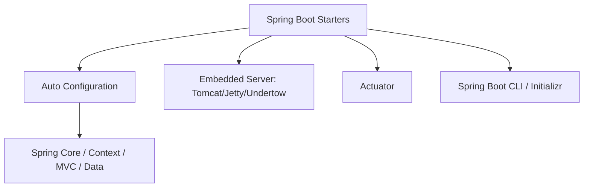

# Module 1: Introduction to Spring Boot

## Topics Covered
- Why Spring Boot
- Spring Boot architecture
- Auto configuration
- Spring Initializr

---

## 1. Why Spring Boot

Spring Boot was created to remove the configuration burden that traditional Spring applications required. Key motivations:

- **Convention over configuration** — sensible defaults reduce the need for explicit bean wiring.
- **Standalone applications** — embedded servers (Tomcat, Jetty, Undertow) mean no need to deploy WAR files to an external container.
- **Production-ready out of the box** — health checks, metrics, and externalized configuration via Actuator.
- **Simplified dependency management** — starter POMs bundle compatible library versions.
- **Faster onboarding** — new developers can bootstrap a working application in minutes via Spring Initializr.

| Traditional Spring | Spring Boot |
|---|---|
| Manual `web.xml` / `DispatcherServlet` setup | Auto-configured embedded server |
| Manual dependency version management | Managed via parent POM / BOM |
| External application server (Tomcat/JBoss) | Embedded server, runnable JAR |
| Explicit `@EnableXxx` configuration | Auto-configuration based on classpath |

## 2. Spring Boot Architecture

Spring Boot builds on top of the core Spring Framework, adding several layers:



- **Starters**: curated dependency descriptors (e.g., `spring-boot-starter-web`) that pull in compatible libraries.
- **Auto Configuration**: automatically configures beans based on classpath contents and existing bean definitions.
- **Embedded Server**: packages the servlet container inside the application JAR.
- **Actuator**: exposes production-ready endpoints for monitoring and management.
- **SpringApplication**: the bootstrap class that starts the `ApplicationContext`.

```java
@SpringBootApplication
public class DemoApplication {
    public static void main(String[] args) {
        SpringApplication.run(DemoApplication.class, args);
    }
}
```

`@SpringBootApplication` is a meta-annotation combining:
- `@SpringBootConfiguration` (a specialization of `@Configuration`)
- `@EnableAutoConfiguration`
- `@ComponentScan`

## 3. Auto Configuration

Auto configuration inspects the classpath and existing bean definitions, then automatically configures beans that would otherwise need to be declared manually.

```java
@Configuration
@ConditionalOnClass(DataSource.class)
@ConditionalOnMissingBean(DataSource.class)
public class DataSourceAutoConfiguration {
    @Bean
    public DataSource dataSource() {
        return new HikariDataSource();
    }
}
```

- Driven by `@Conditional...` annotations: `@ConditionalOnClass`, `@ConditionalOnMissingBean`, `@ConditionalOnProperty`, etc.
- Auto configuration classes are registered via `META-INF/spring/org.springframework.boot.autoconfigure.AutoConfiguration.imports` (Spring Boot 2.7+) or `spring.factories` (older versions).
- You can inspect what got auto-configured (and why) using the Actuator `/actuator/conditions` endpoint or `--debug` flag at startup.
- Auto-configuration always backs off if you define your own bean of the same type.

## 4. Spring Initializr

[Spring Initializr](https://start.spring.io/) is a web-based (and CLI/IDE-integrated) project generator for bootstrapping Spring Boot applications.

Steps to generate a project:
1. Choose build tool: Maven or Gradle.
2. Choose language: Java, Kotlin, or Groovy.
3. Choose Spring Boot version.
4. Fill in project metadata (Group, Artifact, Name, Package name).
5. Choose packaging: Jar or War.
6. Choose Java version.
7. Add dependencies (starters) such as `Spring Web`, `Spring Data JPA`, `Spring Boot DevTools`.
8. Generate — downloads a ready-to-run project skeleton (zip).

Equivalent via `curl`:

```bash
curl https://start.spring.io/starter.zip \
  -d dependencies=web,devtools \
  -d javaVersion=21 \
  -d bootVersion=3.4.0 \
  -o demo.zip
```

Also available directly inside IntelliJ IDEA and VS Code (via the Spring Boot extension pack).

---

## Key Takeaways
- Spring Boot eliminates repetitive configuration through starters and auto-configuration.
- `@SpringBootApplication` bootstraps component scanning, configuration, and auto-configuration in one annotation.
- Auto configuration is conditional and backs off when you provide your own beans.
- Spring Initializr is the fastest way to scaffold a new Spring Boot project.
