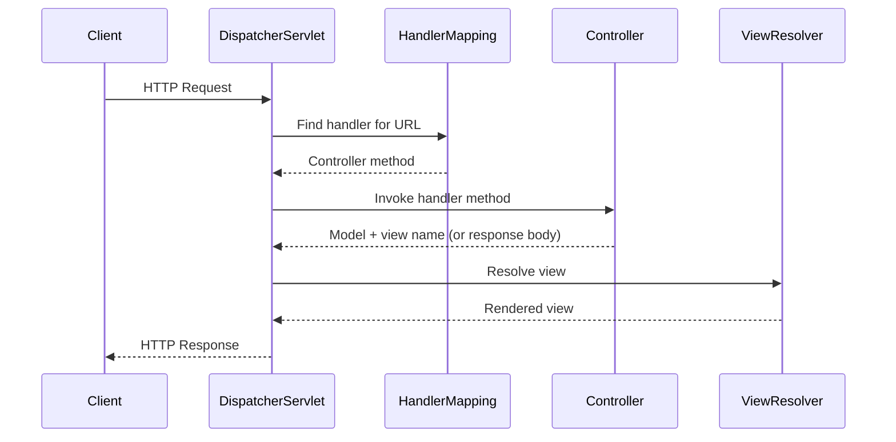

# Module 1: Spring MVC Architecture

## Topics Covered
- MVC pattern
- Dispatcher Servlet
- Controllers
- Request mapping

---

## 1. MVC Pattern

Model-View-Controller (MVC) separates an application into three responsibilities:

- **Model** — application data and business logic (POJOs, services, repositories).
- **View** — presentation/rendering of data (JSP, Thymeleaf, or JSON for REST APIs).
- **Controller** — receives requests, invokes business logic, and selects the view/response.

Benefits: separation of concerns, testability, and parallel development of layers.

## 2. DispatcherServlet

`DispatcherServlet` is the front controller in Spring MVC — a single servlet that receives all incoming HTTP requests and delegates them to the appropriate handler.



In Spring Boot, `DispatcherServlet` is auto-configured and registered automatically when `spring-boot-starter-web` is on the classpath — no `web.xml` needed.

## 3. Controllers

Controllers handle incoming requests and produce a response, either a view name (traditional MVC) or a response body (REST).

```java
@Controller
public class HomeController {

    @GetMapping("/home")
    public String home(Model model) {
        model.addAttribute("message", "Welcome");
        return "home"; // resolves to a view template, e.g., home.html
    }
}
```

For REST APIs, `@RestController` (`@Controller` + `@ResponseBody`) writes the return value directly to the HTTP response body (typically serialized as JSON):

```java
@RestController
@RequestMapping("/api/employees")
public class EmployeeController {

    @GetMapping("/{id}")
    public Employee getEmployee(@PathVariable Long id) {
        return new Employee(id, "Jane Doe");
    }
}
```

## 4. Request Mapping

`@RequestMapping` (and its HTTP-method-specific shortcuts) maps URLs and HTTP methods to controller methods.

```java
@RestController
@RequestMapping("/api/employees")
public class EmployeeController {

    @GetMapping             // GET /api/employees
    public List<Employee> getAll() { ... }

    @GetMapping("/{id}")    // GET /api/employees/{id}
    public Employee getById(@PathVariable Long id) { ... }

    @PostMapping            // POST /api/employees
    public Employee create(@RequestBody Employee employee) { ... }

    @PutMapping("/{id}")    // PUT /api/employees/{id}
    public Employee update(@PathVariable Long id, @RequestBody Employee employee) { ... }

    @DeleteMapping("/{id}") // DELETE /api/employees/{id}
    public void delete(@PathVariable Long id) { ... }
}
```

| Annotation | HTTP Method |
|---|---|
| `@GetMapping` | GET |
| `@PostMapping` | POST |
| `@PutMapping` | PUT |
| `@PatchMapping` | PATCH |
| `@DeleteMapping` | DELETE |

`@RequestMapping` at the class level defines a common base path shared by all handler methods in the controller.

---

## Key Takeaways
- Spring MVC follows the Model-View-Controller pattern to separate concerns.
- `DispatcherServlet` is the single front controller that routes every request.
- `@Controller` returns view names; `@RestController` returns response bodies directly.
- `@RequestMapping` (and method-specific variants) binds URLs/HTTP verbs to controller methods.
